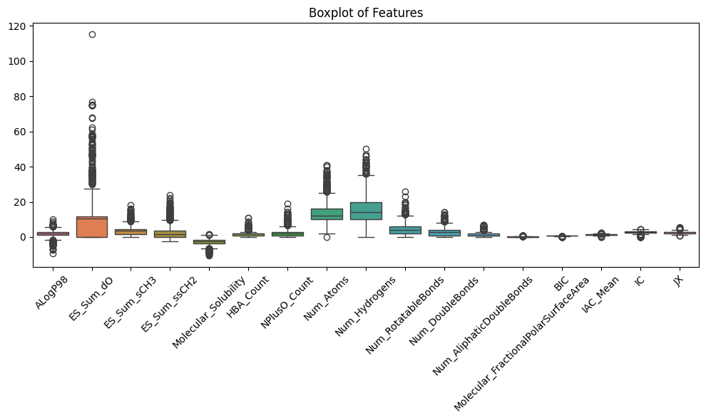
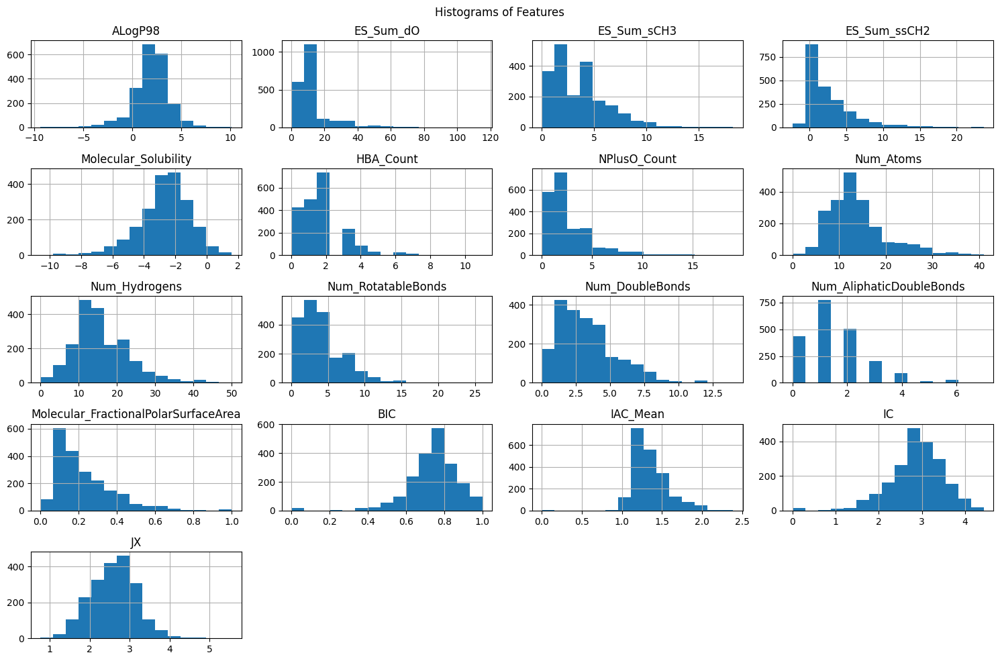

# Preferably use the google colab link to review
https://colab.research.google.com/drive/1gL1YBxB3y2bT9K8sySth1oNnn_SwKHPe?usp=sharing


```python
import pandas as pd
import numpy as np
import seaborn as sns
import matplotlib.pyplot as plt
from sklearn.preprocessing import StandardScaler

from google.colab import files
```


```python
df = pd.read_csv('Bitter.csv')
```
    

#Understanding the DataFrame for it's preperation
We decided not to display data visualizations at this stage because the dataset is too large, making it difficult to find any meaningful patterns with the human eye.


```python
df.head()
```


  <div id="df-c2b4caec-9351-4525-9ad3-53108ce52e77" class="colab-df-container">
    <div>

<table border="1" class="dataframe">
  <thead>
    <tr style="text-align: right;">
      <th></th>
      <th>Index</th>
      <th>Name</th>
      <th>PUBCHEM_COMPOUND_CID</th>
      <th>ACTIVITY</th>
      <th>ID</th>
      <th>NonBitterID</th>
      <th>Smiles</th>
      <th>Frequency</th>
      <th>Canonical_Smiles</th>
      <th>Standardize_Actions_Taken</th>
      <th>...</th>
      <th>Kappa_2_AM</th>
      <th>Kappa_3</th>
      <th>Kappa_3_AM</th>
      <th>PHI</th>
      <th>SC_0</th>
      <th>SC_1</th>
      <th>SC_2</th>
      <th>SC_3_C</th>
      <th>SC_3_CH</th>
      <th>SC_3_P</th>
    </tr>
  </thead>
  <tbody>
    <tr>
      <th>0</th>
      <td>1</td>
      <td>7765</td>
      <td>7,765</td>
      <td>Non-Bitter</td>
      <td>NaN</td>
      <td>1_Fnb</td>
      <td>O(C([H])([H])C([H])([H])[H])C([H])(C([H])([H])...</td>
      <td>1.0</td>
      <td>CCOC(C)OCC</td>
      <td>NaN</td>
      <td>...</td>
      <td>5.06450</td>
      <td>5.00000</td>
      <td>4.92000</td>
      <td>5.01386</td>
      <td>8.0</td>
      <td>7.0</td>
      <td>7.0</td>
      <td>1.0</td>
      <td>0.0</td>
      <td>6.0</td>
    </tr>
    <tr>
      <th>1</th>
      <td>2</td>
      <td>177</td>
      <td>177</td>
      <td>Non-Bitter</td>
      <td>2_Fnb</td>
      <td>2_Fnb</td>
      <td>O=C([H])C([H])([H])[H]</td>
      <td>1.0</td>
      <td>CC=O</td>
      <td>NaN</td>
      <td>...</td>
      <td>1.67000</td>
      <td>0.00000</td>
      <td>0.00000</td>
      <td>1.48630</td>
      <td>3.0</td>
      <td>2.0</td>
      <td>1.0</td>
      <td>0.0</td>
      <td>0.0</td>
      <td>0.0</td>
    </tr>
    <tr>
      <th>2</th>
      <td>3</td>
      <td>62876</td>
      <td>62,876</td>
      <td>Non-Bitter</td>
      <td>3_Fnb</td>
      <td>3_Fnb</td>
      <td>O(C([H])(C([H])([H])[H])OC([H])([H])C([H])([H]...</td>
      <td>1.0</td>
      <td>CCCCOC(C)OCCc1ccccc1</td>
      <td>StandardizeStereo\nStandardizeStereo_ChiralFlag</td>
      <td>...</td>
      <td>8.31033</td>
      <td>7.05817</td>
      <td>6.36993</td>
      <td>6.85916</td>
      <td>16.0</td>
      <td>16.0</td>
      <td>18.0</td>
      <td>2.0</td>
      <td>0.0</td>
      <td>19.0</td>
    </tr>
    <tr>
      <th>3</th>
      <td>4</td>
      <td>83036</td>
      <td>83,036</td>
      <td>Non-Bitter</td>
      <td>4_Fnb</td>
      <td>4_Fnb</td>
      <td>O(C([H])(C([H])([H])[H])OC([H])([H])C([H])([H]...</td>
      <td>1.0</td>
      <td>CC(C)CCOC(C)OCCC(C)C</td>
      <td>NaN</td>
      <td>...</td>
      <td>8.24664</td>
      <td>11.00000</td>
      <td>10.92000</td>
      <td>8.19952</td>
      <td>14.0</td>
      <td>13.0</td>
      <td>15.0</td>
      <td>3.0</td>
      <td>0.0</td>
      <td>12.0</td>
    </tr>
    <tr>
      <th>4</th>
      <td>5</td>
      <td>108504</td>
      <td>108,504</td>
      <td>Non-Bitter</td>
      <td>5_Fnb</td>
      <td>5_Fnb</td>
      <td>O(C([H])([H])C([H])([H])C([H])=C([H])C([H])([H...</td>
      <td>1.0</td>
      <td>CCOC(C)OCCC=CCC</td>
      <td>StandardizeStereo\nStandardizeStereo_ChiralFlag</td>
      <td>...</td>
      <td>8.75380</td>
      <td>9.00000</td>
      <td>8.65999</td>
      <td>8.50578</td>
      <td>12.0</td>
      <td>11.0</td>
      <td>11.0</td>
      <td>1.0</td>
      <td>0.0</td>
      <td>10.0</td>
    </tr>
  </tbody>
</table>
<p>5 rows × 310 columns</p>
</div>
    <div class="colab-df-buttons">

  <div class="colab-df-container">
    <button class="colab-df-convert" onclick="convertToInteractive('df-c2b4caec-9351-4525-9ad3-53108ce52e77')"
            title="Convert this dataframe to an interactive table."
            style="display:none;">

  <svg xmlns="http://www.w3.org/2000/svg" height="24px" viewBox="0 -960 960 960">
    <path d="M120-120v-720h720v720H120Zm60-500h600v-160H180v160Zm220 220h160v-160H400v160Zm0 220h160v-160H400v160ZM180-400h160v-160H180v160Zm440 0h160v-160H620v160ZM180-180h160v-160H180v160Zm440 0h160v-160H620v160Z"/>
  </svg>
    </button>


```python
df.shape
```


    (2075, 310)


```python
df.describe()
```


  <div id="df-4822b446-b2fd-40de-a73e-7a4d4d3e42b8" class="colab-df-container">
    <div>
        
<table border="1" class="dataframe">
  <thead>
    <tr style="text-align: right;">
      <th></th>
      <th>Frequency</th>
      <th>ALogP98</th>
      <th>ALogP98_Unknown</th>
      <th>ES_Sum_aaaC</th>
      <th>ES_Sum_aaCH</th>
      <th>ES_Sum_aaN</th>
      <th>ES_Sum_aaNH</th>
      <th>ES_Sum_aaO</th>
      <th>ES_Sum_aaS</th>
      <th>ES_Sum_aasC</th>
      <th>...</th>
      <th>Kappa_2_AM</th>
      <th>Kappa_3</th>
      <th>Kappa_3_AM</th>
      <th>PHI</th>
      <th>SC_0</th>
      <th>SC_1</th>
      <th>SC_2</th>
      <th>SC_3_C</th>
      <th>SC_3_CH</th>
      <th>SC_3_P</th>
    </tr>
  </thead>
  <tbody>
    <tr>
      <th>count</th>
      <td>1528.0</td>
      <td>2074.000000</td>
      <td>2074.000000</td>
      <td>2075.000000</td>
      <td>2075.000000</td>
      <td>2075.000000</td>
      <td>2075.000000</td>
      <td>2075.000000</td>
      <td>2075.000000</td>
      <td>2075.000000</td>
      <td>...</td>
      <td>2074.000000</td>
      <td>2074.000000</td>
      <td>2074.000000</td>
      <td>2074.000000</td>
      <td>2074.000000</td>
      <td>2074.000000</td>
      <td>2074.000000</td>
      <td>2074.000000</td>
      <td>2074.000000</td>
      <td>2074.000000</td>
    </tr>
    <tr>
      <th>mean</th>
      <td>1.0</td>
      <td>1.963849</td>
      <td>0.036644</td>
      <td>0.062817</td>
      <td>3.634440</td>
      <td>0.449053</td>
      <td>0.052508</td>
      <td>0.220668</td>
      <td>0.023923</td>
      <td>0.563807</td>
      <td>...</td>
      <td>5.698783</td>
      <td>5.007059</td>
      <td>4.492908</td>
      <td>4.792347</td>
      <td>14.308100</td>
      <td>14.430569</td>
      <td>18.829315</td>
      <td>4.572806</td>
      <td>0.009643</td>
      <td>22.341369</td>
    </tr>
    <tr>
      <th>std</th>
      <td>0.0</td>
      <td>1.995334</td>
      <td>0.200356</td>
      <td>0.388360</td>
      <td>5.113806</td>
      <td>1.798219</td>
      <td>0.468336</td>
      <td>1.111293</td>
      <td>0.192800</td>
      <td>1.601901</td>
      <td>...</td>
      <td>4.204547</td>
      <td>4.140302</td>
      <td>3.910648</td>
      <td>3.898014</td>
      <td>9.387158</td>
      <td>10.276977</td>
      <td>15.720478</td>
      <td>5.342107</td>
      <td>0.102565</td>
      <td>22.543845</td>
    </tr>
    <tr>
      <th>min</th>
      <td>1.0</td>
      <td>-24.030000</td>
      <td>0.000000</td>
      <td>0.000000</td>
      <td>0.000000</td>
      <td>0.000000</td>
      <td>0.000000</td>
      <td>0.000000</td>
      <td>0.000000</td>
      <td>-47.474000</td>
      <td>...</td>
      <td>0.000000</td>
      <td>0.000000</td>
      <td>0.000000</td>
      <td>0.000000</td>
      <td>2.000000</td>
      <td>1.000000</td>
      <td>0.000000</td>
      <td>0.000000</td>
      <td>0.000000</td>
      <td>0.000000</td>
    </tr>
    <tr>
      <th>25%</th>
      <td>1.0</td>
      <td>1.073750</td>
      <td>0.000000</td>
      <td>0.000000</td>
      <td>0.000000</td>
      <td>0.000000</td>
      <td>0.000000</td>
      <td>0.000000</td>
      <td>0.000000</td>
      <td>0.000000</td>
      <td>...</td>
      <td>3.384270</td>
      <td>2.493070</td>
      <td>2.062140</td>
      <td>2.639703</td>
      <td>10.000000</td>
      <td>9.000000</td>
      <td>10.000000</td>
      <td>2.000000</td>
      <td>0.000000</td>
      <td>10.000000</td>
    </tr>
    <tr>
      <th>50%</th>
      <td>1.0</td>
      <td>2.074000</td>
      <td>0.000000</td>
      <td>0.000000</td>
      <td>0.000000</td>
      <td>0.000000</td>
      <td>0.000000</td>
      <td>0.000000</td>
      <td>0.000000</td>
      <td>0.000000</td>
      <td>...</td>
      <td>4.905980</td>
      <td>4.000000</td>
      <td>3.446685</td>
      <td>3.976895</td>
      <td>12.000000</td>
      <td>12.000000</td>
      <td>15.000000</td>
      <td>3.000000</td>
      <td>0.000000</td>
      <td>16.000000</td>
    </tr>
    <tr>
      <th>75%</th>
      <td>1.0</td>
      <td>3.011250</td>
      <td>0.000000</td>
      <td>0.000000</td>
      <td>7.054500</td>
      <td>0.000000</td>
      <td>0.000000</td>
      <td>0.000000</td>
      <td>0.000000</td>
      <td>1.069500</td>
      <td>...</td>
      <td>7.086882</td>
      <td>6.393018</td>
      <td>5.862315</td>
      <td>6.066800</td>
      <td>16.750000</td>
      <td>17.000000</td>
      <td>22.000000</td>
      <td>6.000000</td>
      <td>0.000000</td>
      <td>27.000000</td>
    </tr>
    <tr>
      <th>max</th>
      <td>1.0</td>
      <td>22.258000</td>
      <td>2.000000</td>
      <td>4.855000</td>
      <td>35.843000</td>
      <td>21.678000</td>
      <td>8.359000</td>
      <td>10.961000</td>
      <td>1.758000</td>
      <td>13.481000</td>
      <td>...</td>
      <td>106.229000</td>
      <td>91.331300</td>
      <td>75.061700</td>
      <td>89.578200</td>
      <td>246.000000</td>
      <td>252.000000</td>
      <td>340.000000</td>
      <td>82.000000</td>
      <td>2.000000</td>
      <td>398.000000</td>
    </tr>
  </tbody>
</table>
<p>8 rows × 274 columns</p>
</div>
    <div class="colab-df-buttons">

  <div class="colab-df-container">
    <button class="colab-df-convert" onclick="convertToInteractive('df-4822b446-b2fd-40de-a73e-7a4d4d3e42b8')"
            title="Convert this dataframe to an interactive table."
            style="display:none;">

  <svg xmlns="http://www.w3.org/2000/svg" height="24px" viewBox="0 -960 960 960">
    <path d="M120-120v-720h720v720H120Zm60-500h600v-160H180v160Zm220 220h160v-160H400v160Zm0 220h160v-160H400v160ZM180-400h160v-160H180v160Zm440 0h160v-160H620v160ZM180-180h160v-160H180v160Zm440 0h160v-160H620v160Z"/>
  </svg>
    </button>


```python
df.columns
```


    Index(['Index', 'Name', 'PUBCHEM_COMPOUND_CID', 'ACTIVITY', 'ID',
           'NonBitterID', 'Smiles', 'Frequency', 'Canonical_Smiles',
           'Standardize_Actions_Taken',
           ...
           'Kappa_2_AM', 'Kappa_3', 'Kappa_3_AM', 'PHI', 'SC_0', 'SC_1', 'SC_2',
           'SC_3_C', 'SC_3_CH', 'SC_3_P'],
          dtype='object', length=310)


```python
df.dtypes.unique()
```


    array([dtype('O'), dtype('float64'), dtype('int64'), dtype('bool')],
          dtype=object)


```python
df.isnull().sum().sort_values(ascending=0)
```


<div>

<table border="1" class="dataframe">
  <thead>
    <tr style="text-align: right;">
      <th></th>
      <th>0</th>
    </tr>
  </thead>
  <tbody>
    <tr>
      <th>Standardize_Actions_Taken</th>
      <td>1674</td>
    </tr>
    <tr>
      <th>ID</th>
      <td>679</td>
    </tr>
    <tr>
      <th>Smiles</th>
      <td>547</td>
    </tr>
    <tr>
      <th>Canonical_Smiles</th>
      <td>547</td>
    </tr>
    <tr>
      <th>Frequency</th>
      <td>547</td>
    </tr>
    <tr>
      <th>...</th>
      <td>...</td>
    </tr>
    <tr>
      <th>ES_Count_sssCH</th>
      <td>0</td>
    </tr>
    <tr>
      <th>ES_Count_sssdAs</th>
      <td>0</td>
    </tr>
    <tr>
      <th>ES_Count_ssSe</th>
      <td>0</td>
    </tr>
    <tr>
      <th>ES_Count_sssGeH</th>
      <td>0</td>
    </tr>
    <tr>
      <th>ES_Count_ssssB</th>
      <td>0</td>
    </tr>
  </tbody>
</table>
<p>310 rows × 1 columns</p>
</div><br><label><b>dtype:</b> int64</label>


#Creating a new copy of the DataFrame excluding features with non-beneficiary data:


```python
new_df = df.copy()
```


```python
new_df['ACTIVITY'].replace(['Bitter', 'Non-Bitter'], [int(1), int(0)], inplace=True)
```


```python
cols_to_remove = new_df.select_dtypes(include='object').columns
new_df = new_df.drop(columns=cols_to_remove)

print(cols_to_remove, len(cols_to_remove))
print("New Shape: ", new_df.shape)

# Columns that are from type object, to be removed
```

    Index(['Index', 'Name', 'PUBCHEM_COMPOUND_CID', 'ID', 'NonBitterID', 'Smiles',
           'Canonical_Smiles', 'Standardize_Actions_Taken', 'Apol',
           'Gasteiger_Charges', 'Molecular_Formula', 'Molecular_Composition',
           'Molecular_Weight', 'Molecular_Mass', 'VSA_TotalArea',
           'VSA_AtomicAreas', 'VSA_AlogP', 'VSA_MR', 'VSA_PartialCharge',
           'Molecular_SurfaceArea', 'Molecular_PolarSurfaceArea', 'Molecular_SASA',
           'Molecular_PolarSASA', 'Molecular_SAVol', 'E_ADJ_equ', 'E_ADJ_mag',
           'E_DIST_equ', 'E_DIST_mag', 'V_ADJ_equ', 'V_ADJ_mag', 'V_DIST_equ',
           'V_DIST_mag', 'Wiener', 'Zagreb'],
          dtype='object') 34
    New Shape:  (2075, 276)
    


```python
cols_to_remove = new_df.columns[new_df.apply(lambda col: col.value_counts().max() > len(df) / 2)]

cols_to_remove = cols_to_remove[cols_to_remove != 'ACTIVITY']  # Exclude 'ACTIVITY' column
new_df = new_df.drop(columns=cols_to_remove)

print(cols_to_remove, len(cols_to_remove))
print("New Shape: ", new_df.shape)

# Columns that have more than 50% of values are the same, to be removed
```

    Index(['Frequency', 'ALogP98_Unknown', 'ES_Sum_aaaC', 'ES_Sum_aaCH',
           'ES_Sum_aaN', 'ES_Sum_aaNH', 'ES_Sum_aaO', 'ES_Sum_aaS', 'ES_Sum_aasC',
           'ES_Sum_aaSe',
           ...
           'Num_UnknownPseudoStereoAtoms', 'Num_MesoStereoAtoms',
           'Num_EnhancedStereoAtoms', 'Num_QueryAtoms', 'Num_QueryBonds',
           'Num_H_Donors', 'Num_H_Donors_Lipinski', 'CHI_3_CH', 'CHI_V_3_CH',
           'SC_3_CH'],
          dtype='object', length=210) 210
    New Shape:  (2075, 66)
    


```python
cols_to_remove = new_df.columns[new_df.isnull().mean() > 0.05]
print(cols_to_remove, len(cols_to_remove))

# Columns that have more than 5% of values as null, there are none, but in theory to be removed
```

    Index([], dtype='object') 0
    


```python
new_df.head()
```


  <div id="df-ac9449c7-a811-4cf4-9f80-edda8f18134e" class="colab-df-container">
    <div>


<table border="1" class="dataframe">
  <thead>
    <tr style="text-align: right;">
      <th></th>
      <th>ACTIVITY</th>
      <th>ALogP98</th>
      <th>ES_Sum_dO</th>
      <th>ES_Sum_dssC</th>
      <th>ES_Sum_sCH3</th>
      <th>ES_Sum_ssCH2</th>
      <th>ES_Count_dssC</th>
      <th>ES_Count_sCH3</th>
      <th>ES_Count_ssCH2</th>
      <th>LogD</th>
      <th>...</th>
      <th>Kappa_2</th>
      <th>Kappa_2_AM</th>
      <th>Kappa_3</th>
      <th>Kappa_3_AM</th>
      <th>PHI</th>
      <th>SC_0</th>
      <th>SC_1</th>
      <th>SC_2</th>
      <th>SC_3_C</th>
      <th>SC_3_P</th>
    </tr>
  </thead>
  <tbody>
    <tr>
      <th>0</th>
      <td>0</td>
      <td>0.777</td>
      <td>0.000</td>
      <td>0.0</td>
      <td>5.803</td>
      <td>1.446</td>
      <td>0</td>
      <td>3</td>
      <td>2</td>
      <td>0.777</td>
      <td>...</td>
      <td>5.14285</td>
      <td>5.06450</td>
      <td>5.00000</td>
      <td>4.92000</td>
      <td>5.01386</td>
      <td>8.0</td>
      <td>7.0</td>
      <td>7.0</td>
      <td>1.0</td>
      <td>6.0</td>
    </tr>
    <tr>
      <th>1</th>
      <td>0</td>
      <td>-0.183</td>
      <td>8.805</td>
      <td>0.0</td>
      <td>1.444</td>
      <td>0.000</td>
      <td>0</td>
      <td>1</td>
      <td>0</td>
      <td>-0.183</td>
      <td>...</td>
      <td>2.00000</td>
      <td>1.67000</td>
      <td>0.00000</td>
      <td>0.00000</td>
      <td>1.48630</td>
      <td>3.0</td>
      <td>2.0</td>
      <td>1.0</td>
      <td>0.0</td>
      <td>0.0</td>
    </tr>
    <tr>
      <th>2</th>
      <td>0</td>
      <td>3.313</td>
      <td>0.000</td>
      <td>0.0</td>
      <td>4.116</td>
      <td>4.727</td>
      <td>0</td>
      <td>2</td>
      <td>5</td>
      <td>3.313</td>
      <td>...</td>
      <td>9.07407</td>
      <td>8.31033</td>
      <td>7.05817</td>
      <td>6.36993</td>
      <td>6.85916</td>
      <td>16.0</td>
      <td>16.0</td>
      <td>18.0</td>
      <td>2.0</td>
      <td>19.0</td>
    </tr>
    <tr>
      <th>3</th>
      <td>0</td>
      <td>3.240</td>
      <td>0.000</td>
      <td>0.0</td>
      <td>10.781</td>
      <td>3.830</td>
      <td>0</td>
      <td>5</td>
      <td>4</td>
      <td>3.240</td>
      <td>...</td>
      <td>8.31999</td>
      <td>8.24664</td>
      <td>11.00000</td>
      <td>10.92000</td>
      <td>8.19952</td>
      <td>14.0</td>
      <td>13.0</td>
      <td>15.0</td>
      <td>3.0</td>
      <td>12.0</td>
    </tr>
    <tr>
      <th>4</th>
      <td>0</td>
      <td>2.225</td>
      <td>0.000</td>
      <td>0.0</td>
      <td>6.017</td>
      <td>3.537</td>
      <td>0</td>
      <td>3</td>
      <td>4</td>
      <td>2.225</td>
      <td>...</td>
      <td>9.09090</td>
      <td>8.75380</td>
      <td>9.00000</td>
      <td>8.65999</td>
      <td>8.50578</td>
      <td>12.0</td>
      <td>11.0</td>
      <td>11.0</td>
      <td>1.0</td>
      <td>10.0</td>
    </tr>
  </tbody>
</table>
<p>5 rows × 66 columns</p>
</div>
    <div class="colab-df-buttons">

  <div class="colab-df-container">
    <button class="colab-df-convert" onclick="convertToInteractive('df-ac9449c7-a811-4cf4-9f80-edda8f18134e')"
            title="Convert this dataframe to an interactive table."
            style="display:none;">

  <svg xmlns="http://www.w3.org/2000/svg" height="24px" viewBox="0 -960 960 960">
    <path d="M120-120v-720h720v720H120Zm60-500h600v-160H180v160Zm220 220h160v-160H400v160Zm0 220h160v-160H400v160ZM180-400h160v-160H180v160Zm440 0h160v-160H620v160ZM180-180h160v-160H180v160Zm440 0h160v-160H620v160Z"/>
  </svg>
    </button>


##Finding and Removing Features that have high outliers count: (Using IQR)


```python
Q1 = new_df.quantile(0.25)
Q3 = new_df.quantile(0.75)
IQR = Q3 - Q1

outliers = ((new_df < Q1 - 1.5 * IQR) | (new_df > Q3 + 1.5 * IQR))
outlier_percentage = outliers.sum() / len(new_df) * 100

# Drop columns with more than 10% outliers
threshold = 10
columns_to_drop = outlier_percentage[outlier_percentage > threshold].index
new_df = new_df.drop(columns=columns_to_drop)

print(columns_to_drop, len(columns_to_drop))
print("New Shape: ", new_df.shape)
```

    Index(['ES_Sum_dssC', 'ES_Count_dssC'], dtype='object') 2
    New Shape:  (2075, 64)
    

##Finding and Removing rows with too many outliers from the copy DataFrame:


```python
outliers = ((new_df<=(new_df.mean()-3*new_df.std())) | (new_df>=(new_df.mean()+3*new_df.std())))
outliers_count=outliers.sum(axis=1)
outliers_count.sort_values(ascending=0)
```


<div>

    .dataframe tbody tr th {
        vertical-align: top;
    }

    .dataframe thead th {
        text-align: right;
    }
<table border="1" class="dataframe">
  <thead>
    <tr style="text-align: right;">
      <th></th>
      <th>0</th>
    </tr>
  </thead>
  <tbody>
    <tr>
      <th>1434</th>
      <td>55</td>
    </tr>
    <tr>
      <th>1289</th>
      <td>49</td>
    </tr>
    <tr>
      <th>2025</th>
      <td>48</td>
    </tr>
    <tr>
      <th>204</th>
      <td>44</td>
    </tr>
    <tr>
      <th>532</th>
      <td>39</td>
    </tr>
    <tr>
      <th>...</th>
      <td>...</td>
    </tr>
    <tr>
      <th>708</th>
      <td>0</td>
    </tr>
    <tr>
      <th>707</th>
      <td>0</td>
    </tr>
    <tr>
      <th>706</th>
      <td>0</td>
    </tr>
    <tr>
      <th>705</th>
      <td>0</td>
    </tr>
    <tr>
      <th>2074</th>
      <td>0</td>
    </tr>
  </tbody>
</table>
<p>2075 rows × 1 columns</p>
</div><br><label><b>dtype:</b> int64</label>


```python
outliers_rows_to_drop = new_df.index[outliers_count/len(new_df.columns)>0.2]
new_df = new_df.drop(outliers_rows_to_drop)

print(outliers_rows_to_drop, len(outliers_rows_to_drop))
print("New Shape: ", new_df.shape)

# Removing rows where more than 20% of their data are outliers.
```

    Index([ 204,  532, 1108, 1224, 1289, 1421, 1434, 1449, 1450, 1527, 1634, 1672,
           1674, 1681, 1708, 1724, 1733, 1741, 1758, 1767, 1831, 1892, 1916, 1993,
           1999, 2025, 2053, 2055],
          dtype='int64') 28
    New Shape:  (2047, 64)
    

##Finding and Removing variables with high correlation from the copy DataFrame: (keeping one)


```python
corr_matrix = new_df.corr().abs()
corr_matrix = corr_matrix.where(np.triu(np.ones(corr_matrix.shape), k=1).astype(bool))
high_corr_cols = corr_matrix.columns[(corr_matrix.max() > 0.8)].to_list()
new_df = new_df.drop(columns=high_corr_cols)

print(high_corr_cols, len(high_corr_cols))
print("New Shape: ", new_df.shape)

#Removing one of the two variables that have a correlation of more than 0.8 between them.
```

    ['ES_Count_sCH3', 'ES_Count_ssCH2', 'LogD', 'Num_Bonds', 'Num_ExplicitHydrogens', 'Num_ExplicitAtoms', 'Num_ExplicitBonds', 'Num_RingBonds', 'Num_Rings', 'Num_RingAssemblies', 'Num_Rings6', 'Num_Chains', 'Num_ChainAssemblies', 'Num_SingleBonds', 'Num_AliphaticSingleBonds', 'Num_AtomClasses', 'Num_H_Acceptors', 'Num_H_Acceptors_Lipinski', 'Organic_Count', 'Molecular_FractionalPolarSASA', 'CIC', 'IAC_Total', 'SIC', 'CHI_0', 'CHI_1', 'CHI_2', 'CHI_3_C', 'CHI_3_P', 'CHI_V_0', 'CHI_V_1', 'CHI_V_2', 'CHI_V_3_C', 'CHI_V_3_P', 'JY', 'Kappa_1', 'Kappa_1_AM', 'Kappa_2', 'Kappa_2_AM', 'Kappa_3', 'Kappa_3_AM', 'PHI', 'SC_0', 'SC_1', 'SC_2', 'SC_3_C', 'SC_3_P'] 46
    New Shape:  (2047, 18)
    

##The new final DataFrame


```python
new_df
```


  <div id="df-a0f97415-17da-4af0-925b-7b90d1cf4c7a" class="colab-df-container">
    <div>

<table border="1" class="dataframe">
  <thead>
    <tr style="text-align: right;">
      <th></th>
      <th>ACTIVITY</th>
      <th>ALogP98</th>
      <th>ES_Sum_dO</th>
      <th>ES_Sum_sCH3</th>
      <th>ES_Sum_ssCH2</th>
      <th>Molecular_Solubility</th>
      <th>HBA_Count</th>
      <th>NPlusO_Count</th>
      <th>Num_Atoms</th>
      <th>Num_Hydrogens</th>
      <th>Num_RotatableBonds</th>
      <th>Num_DoubleBonds</th>
      <th>Num_AliphaticDoubleBonds</th>
      <th>Molecular_FractionalPolarSurfaceArea</th>
      <th>BIC</th>
      <th>IAC_Mean</th>
      <th>IC</th>
      <th>JX</th>
    </tr>
  </thead>
  <tbody>
    <tr>
      <th>0</th>
      <td>0</td>
      <td>0.777</td>
      <td>0.000</td>
      <td>5.803</td>
      <td>1.446</td>
      <td>-0.883</td>
      <td>2</td>
      <td>2</td>
      <td>8</td>
      <td>14</td>
      <td>4</td>
      <td>0</td>
      <td>0</td>
      <td>0.126</td>
      <td>0.80146</td>
      <td>1.24067</td>
      <td>2.25000</td>
      <td>2.69601</td>
    </tr>
    <tr>
      <th>1</th>
      <td>0</td>
      <td>-0.183</td>
      <td>8.805</td>
      <td>1.444</td>
      <td>0.000</td>
      <td>0.168</td>
      <td>1</td>
      <td>1</td>
      <td>3</td>
      <td>4</td>
      <td>0</td>
      <td>1</td>
      <td>1</td>
      <td>0.286</td>
      <td>1.00000</td>
      <td>1.37878</td>
      <td>1.58496</td>
      <td>2.04654</td>
    </tr>
    <tr>
      <th>2</th>
      <td>0</td>
      <td>3.313</td>
      <td>0.000</td>
      <td>4.116</td>
      <td>4.727</td>
      <td>-4.081</td>
      <td>2</td>
      <td>2</td>
      <td>16</td>
      <td>22</td>
      <td>8</td>
      <td>3</td>
      <td>0</td>
      <td>0.075</td>
      <td>0.74286</td>
      <td>1.21081</td>
      <td>3.15563</td>
      <td>1.98977</td>
    </tr>
    <tr>
      <th>3</th>
      <td>0</td>
      <td>3.240</td>
      <td>0.000</td>
      <td>10.781</td>
      <td>3.830</td>
      <td>-3.227</td>
      <td>2</td>
      <td>2</td>
      <td>14</td>
      <td>26</td>
      <td>8</td>
      <td>0</td>
      <td>0</td>
      <td>0.075</td>
      <td>0.57316</td>
      <td>1.14115</td>
      <td>2.12095</td>
      <td>3.08772</td>
    </tr>
    <tr>
      <th>4</th>
      <td>0</td>
      <td>2.225</td>
      <td>0.000</td>
      <td>6.017</td>
      <td>3.537</td>
      <td>-2.739</td>
      <td>2</td>
      <td>2</td>
      <td>12</td>
      <td>20</td>
      <td>7</td>
      <td>1</td>
      <td>1</td>
      <td>0.089</td>
      <td>0.79649</td>
      <td>1.19819</td>
      <td>2.85538</td>
      <td>2.97687</td>
    </tr>
    <tr>
      <th>...</th>
      <td>...</td>
      <td>...</td>
      <td>...</td>
      <td>...</td>
      <td>...</td>
      <td>...</td>
      <td>...</td>
      <td>...</td>
      <td>...</td>
      <td>...</td>
      <td>...</td>
      <td>...</td>
      <td>...</td>
      <td>...</td>
      <td>...</td>
      <td>...</td>
      <td>...</td>
      <td>...</td>
    </tr>
    <tr>
      <th>2070</th>
      <td>1</td>
      <td>-0.097</td>
      <td>36.782</td>
      <td>4.207</td>
      <td>3.853</td>
      <td>-3.695</td>
      <td>3</td>
      <td>5</td>
      <td>20</td>
      <td>21</td>
      <td>6</td>
      <td>6</td>
      <td>3</td>
      <td>0.235</td>
      <td>0.78275</td>
      <td>1.64300</td>
      <td>3.72192</td>
      <td>1.97271</td>
    </tr>
    <tr>
      <th>2071</th>
      <td>1</td>
      <td>1.800</td>
      <td>37.452</td>
      <td>4.310</td>
      <td>7.512</td>
      <td>-5.098</td>
      <td>3</td>
      <td>5</td>
      <td>23</td>
      <td>27</td>
      <td>9</td>
      <td>6</td>
      <td>3</td>
      <td>0.201</td>
      <td>0.74466</td>
      <td>1.55138</td>
      <td>3.65399</td>
      <td>1.94997</td>
    </tr>
    <tr>
      <th>2072</th>
      <td>1</td>
      <td>1.417</td>
      <td>45.280</td>
      <td>3.781</td>
      <td>1.224</td>
      <td>-2.954</td>
      <td>3</td>
      <td>7</td>
      <td>19</td>
      <td>13</td>
      <td>4</td>
      <td>7</td>
      <td>4</td>
      <td>0.394</td>
      <td>0.80482</td>
      <td>1.90892</td>
      <td>3.82687</td>
      <td>2.43706</td>
    </tr>
    <tr>
      <th>2073</th>
      <td>1</td>
      <td>0.975</td>
      <td>12.746</td>
      <td>6.639</td>
      <td>6.556</td>
      <td>-4.108</td>
      <td>3</td>
      <td>8</td>
      <td>34</td>
      <td>42</td>
      <td>4</td>
      <td>1</td>
      <td>1</td>
      <td>0.290</td>
      <td>0.75381</td>
      <td>1.34412</td>
      <td>3.98423</td>
      <td>1.28817</td>
    </tr>
    <tr>
      <th>2074</th>
      <td>1</td>
      <td>2.508</td>
      <td>0.000</td>
      <td>0.000</td>
      <td>1.487</td>
      <td>-3.264</td>
      <td>1</td>
      <td>3</td>
      <td>18</td>
      <td>13</td>
      <td>1</td>
      <td>6</td>
      <td>0</td>
      <td>0.229</td>
      <td>0.63290</td>
      <td>1.35858</td>
      <td>2.97493</td>
      <td>1.82138</td>
    </tr>
  </tbody>
</table>
<p>2047 rows × 18 columns</p>
</div>
    <div class="colab-df-buttons">

  <div class="colab-df-container">
    <button class="colab-df-convert" onclick="convertToInteractive('df-a0f97415-17da-4af0-925b-7b90d1cf4c7a')"
            title="Convert this dataframe to an interactive table."
            style="display:none;">

  <svg xmlns="http://www.w3.org/2000/svg" height="24px" viewBox="0 -960 960 960">
    <path d="M120-120v-720h720v720H120Zm60-500h600v-160H180v160Zm220 220h160v-160H400v160Zm0 220h160v-160H400v160ZM180-400h160v-160H180v160Zm440 0h160v-160H620v160ZM180-180h160v-160H180v160Zm440 0h160v-160H620v160Z"/>
  </svg>
    </button>


<div id="df-5941b0b7-bf30-4c74-841e-ea2f58a7f8d4">
  <button class="colab-df-quickchart" onclick="quickchart('df-5941b0b7-bf30-4c74-841e-ea2f58a7f8d4')"
            title="Suggest charts"
            style="display:none;">


#Presenting the Data Visualization


```python
plt.figure(figsize=(10, 6))
sns.boxplot(data=new_df.drop("ACTIVITY", axis=1))
plt.title("Boxplot of Features")
plt.xticks(rotation=45)
plt.tight_layout()
plt.show()
```


    

    


```python
plt.figure(figsize=(10, 6))
new_df.drop("ACTIVITY", axis=1).hist(bins=15, figsize=(15, 10))
plt.suptitle("Histograms of Features")
plt.tight_layout()
plt.show()
```


    <Figure size 1000x600 with 0 Axes>


    

    


#Theoretical statistics table for all features:

*No binary features left in the dataset


```python
range_values = []
for col in new_df.drop("ACTIVITY", axis=1).columns:
    range_values.append(f'{new_df[col].min()}-{new_df[col].max()}')

mean_values = []
for col in new_df.drop("ACTIVITY", axis=1).columns:
    mean_values.append(new_df[col].mean())

std_values = []
for col in new_df.drop("ACTIVITY", axis=1).columns:
    std_values.append(new_df[col].std())

stats_df = pd.DataFrame({
    "Range": range_values,
    "Mean": mean_values,
    "Std": std_values
}, index=new_df.drop("ACTIVITY", axis=1).columns)

stats_df
```


  <div id="df-2859babc-5c8d-430b-b55d-0ecac57b2967" class="colab-df-container">
    <div>

<table border="1" class="dataframe">
  <thead>
    <tr style="text-align: right;">
      <th></th>
      <th>Range</th>
      <th>Mean</th>
      <th>Std</th>
    </tr>
  </thead>
  <tbody>
    <tr>
      <th>ALogP98</th>
      <td>-9.389-10.151</td>
      <td>1.964643</td>
      <td>1.774072</td>
    </tr>
    <tr>
      <th>ES_Sum_dO</th>
      <td>0.0-115.224</td>
      <td>11.134658</td>
      <td>11.814309</td>
    </tr>
    <tr>
      <th>ES_Sum_sCH3</th>
      <td>0.0-18.293</td>
      <td>3.472754</td>
      <td>2.709124</td>
    </tr>
    <tr>
      <th>ES_Sum_ssCH2</th>
      <td>-2.321-23.682</td>
      <td>2.605581</td>
      <td>3.366430</td>
    </tr>
    <tr>
      <th>Molecular_Solubility</th>
      <td>-10.588-1.597</td>
      <td>-2.670295</td>
      <td>1.627837</td>
    </tr>
    <tr>
      <th>HBA_Count</th>
      <td>0-11</td>
      <td>1.673669</td>
      <td>1.354189</td>
    </tr>
    <tr>
      <th>NPlusO_Count</th>
      <td>0-19</td>
      <td>2.718613</td>
      <td>2.236059</td>
    </tr>
    <tr>
      <th>Num_Atoms</th>
      <td>0-41</td>
      <td>13.685882</td>
      <td>6.217428</td>
    </tr>
    <tr>
      <th>Num_Hydrogens</th>
      <td>0-50</td>
      <td>15.683928</td>
      <td>7.401108</td>
    </tr>
    <tr>
      <th>Num_RotatableBonds</th>
      <td>0-26</td>
      <td>4.019052</td>
      <td>3.164306</td>
    </tr>
    <tr>
      <th>Num_DoubleBonds</th>
      <td>0-14</td>
      <td>3.077675</td>
      <td>2.313065</td>
    </tr>
    <tr>
      <th>Num_AliphaticDoubleBonds</th>
      <td>0-7</td>
      <td>1.470445</td>
      <td>1.239612</td>
    </tr>
    <tr>
      <th>Molecular_FractionalPolarSurfaceArea</th>
      <td>0.0-1.0</td>
      <td>0.226529</td>
      <td>0.150874</td>
    </tr>
    <tr>
      <th>BIC</th>
      <td>0.0-1.0</td>
      <td>0.740250</td>
      <td>0.135468</td>
    </tr>
    <tr>
      <th>IAC_Mean</th>
      <td>0.0-2.38793</td>
      <td>1.356371</td>
      <td>0.222433</td>
    </tr>
    <tr>
      <th>IC</th>
      <td>0.0-4.43229</td>
      <td>2.866904</td>
      <td>0.642163</td>
    </tr>
    <tr>
      <th>JX</th>
      <td>0.77077-5.55873</td>
      <td>2.607138</td>
      <td>0.569724</td>
    </tr>
  </tbody>
</table>
</div>
    <div class="colab-df-buttons">

  <div class="colab-df-container">
    <button class="colab-df-convert" onclick="convertToInteractive('df-2859babc-5c8d-430b-b55d-0ecac57b2967')"
            title="Convert this dataframe to an interactive table."
            style="display:none;">

  <svg xmlns="http://www.w3.org/2000/svg" height="24px" viewBox="0 -960 960 960">
    <path d="M120-120v-720h720v720H120Zm60-500h600v-160H180v160Zm220 220h160v-160H400v160Zm0 220h160v-160H400v160ZM180-400h160v-160H180v160Zm440 0h160v-160H620v160ZM180-180h160v-160H180v160Zm440 0h160v-160H620v160Z"/>
  </svg>
    </button>


#Noramlizing the Dataset: (using StandradScaler)


```python
scaler = StandardScaler()
normalized_new_df = scaler.fit_transform(new_df.drop("ACTIVITY", axis=1))

normalized_new_df = pd.DataFrame(normalized_new_df, columns=new_df.drop("ACTIVITY", axis=1).columns)

normalized_new_df['ACTIVITY'] = new_df['ACTIVITY']

normalized_new_df
```


  <div id="df-60b85160-f82e-4604-9a88-c2903c49bdb8" class="colab-df-container">
    <div>
<table border="1" class="dataframe">
  <thead>
    <tr style="text-align: right;">
      <th></th>
      <th>ALogP98</th>
      <th>ES_Sum_dO</th>
      <th>ES_Sum_sCH3</th>
      <th>ES_Sum_ssCH2</th>
      <th>Molecular_Solubility</th>
      <th>HBA_Count</th>
      <th>NPlusO_Count</th>
      <th>Num_Atoms</th>
      <th>Num_Hydrogens</th>
      <th>Num_RotatableBonds</th>
      <th>Num_DoubleBonds</th>
      <th>Num_AliphaticDoubleBonds</th>
      <th>Molecular_FractionalPolarSurfaceArea</th>
      <th>BIC</th>
      <th>IAC_Mean</th>
      <th>IC</th>
      <th>JX</th>
      <th>ACTIVITY</th>
    </tr>
  </thead>
  <tbody>
    <tr>
      <th>0</th>
      <td>-0.669609</td>
      <td>-0.942702</td>
      <td>0.860358</td>
      <td>-0.344538</td>
      <td>1.098225</td>
      <td>0.241038</td>
      <td>-0.321453</td>
      <td>-0.914730</td>
      <td>-0.227579</td>
      <td>-0.006022</td>
      <td>-1.330886</td>
      <td>-1.186503</td>
      <td>-0.666475</td>
      <td>0.451949</td>
      <td>-0.520287</td>
      <td>-0.960901</td>
      <td>0.156030</td>
      <td>0.0</td>
    </tr>
    <tr>
      <th>1</th>
      <td>-1.210869</td>
      <td>-0.197238</td>
      <td>-0.749043</td>
      <td>-0.774179</td>
      <td>1.744025</td>
      <td>-0.497592</td>
      <td>-0.768778</td>
      <td>-1.719118</td>
      <td>-1.579059</td>
      <td>-1.270432</td>
      <td>-0.898454</td>
      <td>-0.379602</td>
      <td>0.394273</td>
      <td>1.917895</td>
      <td>0.100772</td>
      <td>-1.996780</td>
      <td>-0.984221</td>
      <td>0.0</td>
    </tr>
    <tr>
      <th>2</th>
      <td>0.760221</td>
      <td>-0.942702</td>
      <td>0.237495</td>
      <td>0.630323</td>
      <td>-0.866825</td>
      <td>0.241038</td>
      <td>-0.321453</td>
      <td>0.372290</td>
      <td>0.853604</td>
      <td>1.258387</td>
      <td>-0.033589</td>
      <td>-1.186503</td>
      <td>-1.004588</td>
      <td>0.019269</td>
      <td>-0.654563</td>
      <td>0.449726</td>
      <td>-1.083890</td>
      <td>0.0</td>
    </tr>
    <tr>
      <th>3</th>
      <td>0.719063</td>
      <td>-0.942702</td>
      <td>2.698301</td>
      <td>0.363803</td>
      <td>-0.342074</td>
      <td>0.241038</td>
      <td>-0.321453</td>
      <td>0.050535</td>
      <td>1.394196</td>
      <td>1.258387</td>
      <td>-1.330886</td>
      <td>-1.186503</td>
      <td>-1.004588</td>
      <td>-1.233733</td>
      <td>-0.967813</td>
      <td>-1.161911</td>
      <td>0.843741</td>
      <td>0.0</td>
    </tr>
    <tr>
      <th>4</th>
      <td>0.146793</td>
      <td>-0.942702</td>
      <td>0.939369</td>
      <td>0.276746</td>
      <td>-0.042217</td>
      <td>0.241038</td>
      <td>-0.321453</td>
      <td>-0.271220</td>
      <td>0.583308</td>
      <td>0.942284</td>
      <td>-0.898454</td>
      <td>-0.379602</td>
      <td>-0.911773</td>
      <td>0.415253</td>
      <td>-0.711313</td>
      <td>-0.017949</td>
      <td>0.649126</td>
      <td>0.0</td>
    </tr>
    <tr>
      <th>...</th>
      <td>...</td>
      <td>...</td>
      <td>...</td>
      <td>...</td>
      <td>...</td>
      <td>...</td>
      <td>...</td>
      <td>...</td>
      <td>...</td>
      <td>...</td>
      <td>...</td>
      <td>...</td>
      <td>...</td>
      <td>...</td>
      <td>...</td>
      <td>...</td>
      <td>...</td>
      <td>...</td>
    </tr>
    <tr>
      <th>2042</th>
      <td>-1.162381</td>
      <td>2.171402</td>
      <td>0.271093</td>
      <td>0.370637</td>
      <td>-0.629642</td>
      <td>0.979668</td>
      <td>1.020521</td>
      <td>1.015800</td>
      <td>0.718456</td>
      <td>0.626182</td>
      <td>1.263708</td>
      <td>1.234200</td>
      <td>0.056160</td>
      <td>0.313802</td>
      <td>1.288927</td>
      <td>1.331790</td>
      <td>-1.113842</td>
      <td>1.0</td>
    </tr>
    <tr>
      <th>2043</th>
      <td>-0.092828</td>
      <td>2.228126</td>
      <td>0.309122</td>
      <td>1.457811</td>
      <td>-1.491733</td>
      <td>0.979668</td>
      <td>1.020521</td>
      <td>1.498432</td>
      <td>1.529344</td>
      <td>1.574489</td>
      <td>1.263708</td>
      <td>1.234200</td>
      <td>-0.169249</td>
      <td>0.032559</td>
      <td>0.876927</td>
      <td>1.225981</td>
      <td>-1.153766</td>
      <td>1.0</td>
    </tr>
    <tr>
      <th>2044</th>
      <td>-0.308768</td>
      <td>2.890875</td>
      <td>0.113809</td>
      <td>-0.410500</td>
      <td>-0.174326</td>
      <td>0.979668</td>
      <td>1.915170</td>
      <td>0.854922</td>
      <td>-0.362727</td>
      <td>-0.006022</td>
      <td>1.696141</td>
      <td>2.041101</td>
      <td>1.110277</td>
      <td>0.476758</td>
      <td>2.484727</td>
      <td>1.495262</td>
      <td>-0.298599</td>
      <td>1.0</td>
    </tr>
    <tr>
      <th>2045</th>
      <td>-0.557974</td>
      <td>0.136422</td>
      <td>1.169020</td>
      <td>1.173761</td>
      <td>-0.883415</td>
      <td>0.979668</td>
      <td>2.362495</td>
      <td>3.268085</td>
      <td>3.556563</td>
      <td>-0.006022</td>
      <td>-0.898454</td>
      <td>-0.379602</td>
      <td>0.420791</td>
      <td>0.100119</td>
      <td>-0.055089</td>
      <td>1.740369</td>
      <td>-2.315664</td>
      <td>1.0</td>
    </tr>
    <tr>
      <th>2046</th>
      <td>0.306352</td>
      <td>-0.942702</td>
      <td>-1.282186</td>
      <td>-0.332356</td>
      <td>-0.364809</td>
      <td>-0.497592</td>
      <td>0.125872</td>
      <td>0.694045</td>
      <td>-0.362727</td>
      <td>-0.954329</td>
      <td>1.263708</td>
      <td>-1.186503</td>
      <td>0.016381</td>
      <td>-0.792635</td>
      <td>0.009936</td>
      <td>0.168264</td>
      <td>-1.379527</td>
      <td>1.0</td>
    </tr>
  </tbody>
</table>
<p>2047 rows × 18 columns</p>
</div>
    <div class="colab-df-buttons">

  <div class="colab-df-container">
    <button class="colab-df-convert" onclick="convertToInteractive('df-60b85160-f82e-4604-9a88-c2903c49bdb8')"
            title="Convert this dataframe to an interactive table."
            style="display:none;">

  <svg xmlns="http://www.w3.org/2000/svg" height="24px" viewBox="0 -960 960 960">
    <path d="M120-120v-720h720v720H120Zm60-500h600v-160H180v160Zm220 220h160v-160H400v160Zm0 220h160v-160H400v160ZM180-400h160v-160H180v160Zm440 0h160v-160H620v160ZM180-180h160v-160H180v160Zm440 0h160v-160H620v160Z"/>
  </svg>
    </button>

    .colab-df-container {
      display:flex;
      gap: 12px;
    }

    .colab-df-convert {
      background-color: #E8F0FE;
      border: none;
      border-radius: 50%;
      cursor: pointer;
      display: none;
      fill: #1967D2;
      height: 32px;
      padding: 0 0 0 0;
      width: 32px;
    }

    .colab-df-convert:hover {
      background-color: #E2EBFA;
      box-shadow: 0px 1px 2px rgba(60, 64, 67, 0.3), 0px 1px 3px 1px rgba(60, 64, 67, 0.15);
      fill: #174EA6;
    }

    .colab-df-buttons div {
      margin-bottom: 4px;
    }

    [theme=dark] .colab-df-convert {
      background-color: #3B4455;
      fill: #D2E3FC;
    }

    [theme=dark] .colab-df-convert:hover {
      background-color: #434B5C;
      box-shadow: 0px 1px 3px 1px rgba(0, 0, 0, 0.15);
      filter: drop-shadow(0px 1px 2px rgba(0, 0, 0, 0.3));
      fill: #FFFFFF;
    }
  </style>

    <script>
      const buttonEl =
        document.querySelector('#df-60b85160-f82e-4604-9a88-c2903c49bdb8 button.colab-df-convert');
      buttonEl.style.display =
        google.colab.kernel.accessAllowed ? 'block' : 'none';

      async function convertToInteractive(key) {
        const element = document.querySelector('#df-60b85160-f82e-4604-9a88-c2903c49bdb8');
        const dataTable =
          await google.colab.kernel.invokeFunction('convertToInteractive',
                                                    [key], {});
        if (!dataTable) return;

        const docLinkHtml = 'Like what you see? Visit the ' +
          '<a target="_blank" href=https://colab.research.google.com/notebooks/data_table.ipynb>data table notebook</a>'
          + ' to learn more about interactive tables.';
        element.innerHTML = '';
        dataTable['output_type'] = 'display_data';
        await google.colab.output.renderOutput(dataTable, element);
        const docLink = document.createElement('div');
        docLink.innerHTML = docLinkHtml;
        element.appendChild(docLink);
      }
    </script>
  </div>


<div id="df-e61552b2-d31c-4b12-adf3-b437d714bc6e">
  <button class="colab-df-quickchart" onclick="quickchart('df-e61552b2-d31c-4b12-adf3-b437d714bc6e')"
            title="Suggest charts"
            style="display:none;">

<svg xmlns="http://www.w3.org/2000/svg" height="24px"viewBox="0 0 24 24"
     width="24px">
    <g>
        <path d="M19 3H5c-1.1 0-2 .9-2 2v14c0 1.1.9 2 2 2h14c1.1 0 2-.9 2-2V5c0-1.1-.9-2-2-2zM9 17H7v-7h2v7zm4 0h-2V7h2v10zm4 0h-2v-4h2v4z"/>
    </g>
</svg>
  </button>


